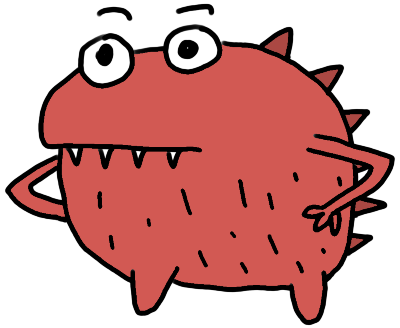
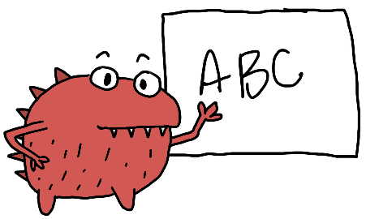
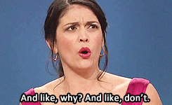
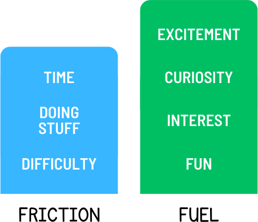
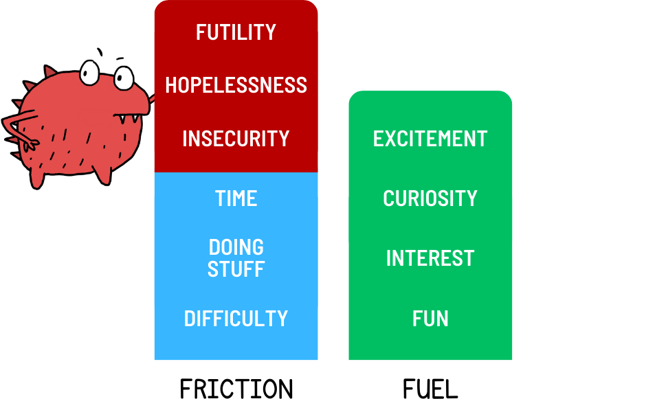
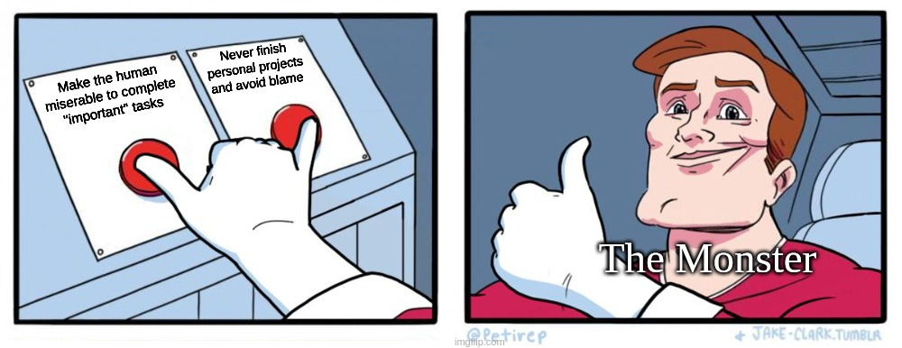
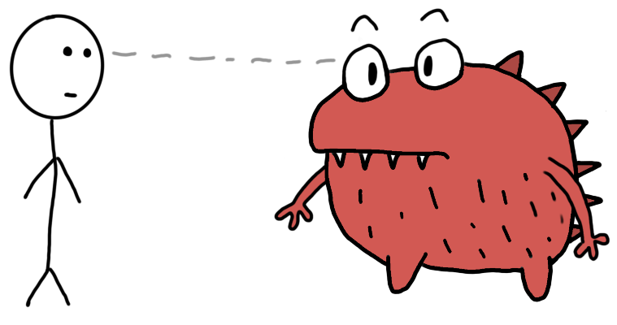
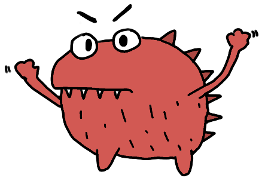

*Advice for people who often start cool projects but rarely get through them.*

## Intro / The Monster

I’ve got a question for you - what do the following thoughts have in common?

* “Before working on anything, I must create a business plan to know what to worry about later.”
* “When should I post this video? What day of the week? What time? If I can figure out the best time and day to post, I’ll totally get more views.”
* “The best thing for me to do next is sit down and write about the best thing to do next.”
* “We need a meeting to plan our meetings for next quarter to ensure we have time for feature design meetings to plan out what we need to build to deliver those features to our clients.”
That last one might be a bit on the nose for anyone who has worked corporate, but do you see a pattern here?[^1]

Questions like these have often held me back in creative and professional pursuits. As soon as I get through the first bit of exciting work, these questions come streaming into my mind. Unfortunately, the longer they’re in my head, the harder it becomes to motivate myself to work on the project.

It feels like a little monster occasionally pops up on my shoulder and begins asking all the “important questions.

Actually, I like that. Let’s name it. I’ll call it “The Monster.”

    

The Monster is always around - lurking behind every deadline, project, and creative idea. So when I decide to write about something, The Monster pipes up and says shit like:

**Monster:** *“Is this the right thing for you to write about? Is there something more attention-grabbing?” … “Your argument doesn’t make sense - start over and re-outline the whole thing.”*

Or - god forbid - I have some cool project or business idea:

**Monster:** *“Does anyone even want this? You should plan out all the features and contingencies and ensure that you have a clear vision. Then you should talk to potential customers in the problem space. And then, only once that’s done, you should start building something.”*

The little pipsqueak is insufferable and virtually impossible to ignore.

Worse yet, The Monster's arguments are often compelling. After all, if I’m going to put a ton of time and effort into something (like possibly years of my life), I need to have a pretty damn good reason for doing that. It’s irresponsible to charge forward on something without doing at least a little bit of homework beforehand, right? And if it makes sense to do some homework, shouldn’t we do all of it?

    
    *This is my personal nightmare.*

Inevitably, The Monster wins, and (assuming we don’t give up immediately) we pull out a piece of paper, a planner, or a blank doc and start trying to do the work that The Monster assigned us.

Usually, it starts out pretty easy…

**Monster:** *“Do you even know what you’re trying to make?”*

**Me:** *"Yes. I’m writing an essay about you, actually."*

And then, suddenly, the homework will morph into a set of impossible questions that has nothing to do with your initial task.

**Monster:** *“Why do you think your insight is valuable? Wouldn’t you prefer to be playing video games? Or even making dinner? Where are you going to post this? What about comments? What if someone leaves a negative comment? Don’t you need to …"*

**Me:** *"Uhhh… Okay… I’m gonna go lie down now."*

On the best days, The Monster distracts us from our work. On the worst days, The Monster makes us doubt ourselves and our abilities and trivialize the things that we create.

**Me:** *"Gah! How does anyone do anything with The Monster constantly breathing down their neck? I can’t just be expected to do all of the work The Monster wants me to do, right? That seems excessive - there’s a lot. But if I don’t do all of the anxiety monster’s homework, then I don’t feel I can make any progress because it makes good arguments… So what - I let the anxiety monster run my entire life, and that’s just how it will be? Forever?! I can’t do that!"*

---

## The Monster is a Dirty Liar

There are two opposing forces at play in our minds. They’re kinda like “motivation” and “difficulty,” but they’re also not at all like “motivation” and “difficulty.”

Let’s ditch the baggage and start with a clean slate: I’ll call them “Fuel” and “Friction.”

**Friction:** is the effort required to get us from where we are to where we want to go. Every task has some amount of friction. If I want a sandwich, I must get up, go to the kitchen, collect the ingredients, and make it. If I want to write a book, I need to figure out what I want to write, outline that, start writing, find an editor, keep writing, get a publishing deal, and so on.

Friction can be physical or emotional – Physical friction is the effort required to do things in the real world (like getting up to make a sandwich.) Emotional friction is the effort needed to get past insecurities or figure out what we want (like deciding what to write about.)

**Fuel:** is the energy our minds use to motivate us to do anything. There are physiological fuels like hunger, thirst, and fatigue, as well as more subtle emotional fuels like curiosity, ambition, interest, and anxiety.

Without friction, fuels drive us toward action:

* We seek food if we have the “hunger” fuel source.
* We read and write poetry if we have the “curiosity and interest in poetry” fuel source.
* We do our taxes if we have the “I don’t want the IRS to put a warrant out for my arrest” fuel source.[^2]

Let’s pretend you’re starting a new Big Creative Project. You’re super duper excited about the project and have already started researching, sketching, coding, or whatever your Big Creative Project requires.

    
    *The wonderful beginnings of a project - where everything is green, beautiful, and blissful.*

Things are pretty effortless in the beginning. You’re probably doing the activity you enjoy most regarding your Big Creative Project. That means you’ve got a ton of “curiosity and interest” fuel to push you forward, and since you’re working on the stuff you enjoy working on, you’ve got very little friction.

*This is like. Totally sustainable. Definitely.*

This is it! This is where The Monster comes in! The Monster is good at playing mind games [^3] , and it has figured out how to manipulate our fuel sources and sense of friction to influence our behaviors.

When failing a task doesn’t have consequences, The Monster gladly gives us an excuse so that we don’t have to do the work in the first place. We get to carry on with our lives (and egos) intact, even if the course of action would have resulted in failure.

A big downside, though - burning that extra-special fuel makes us feel downright awful.

    

If you think about the world from The Monster’s perspective, the situation becomes pretty clear - The Monster is just trying to protect us. It makes sure that we’ll be okay if something in the future might try and hurt us.

---

**Me, and maybe you:** *Who cares if it’s acting in my best interests! I still want to make cool stuff, and this dang Monster is always on my case!*

Yeah, yeah, yeah. I get it. Even though The Monster has good intentions, its actions are damaging.

If we want to live happier, healthier, more productive lives, we must do something about the monster.

***We can stare at The Monster.***

Not literally, of course. There’s no actual monster to stare at. However, we can improve our awareness of when and how the monster messes with our fuel sources.

Let’s force the monster to come out into the light. From there, we can examine how it affects our thoughts and feelings.

**Here's How**

1. Get some paper and something to write with. [^4]
2. Think of a project or task or something that you’ve been working on - we’ll call it your “struggle-project.” I’ll give you extra brownie points if the project is something you’ve been procrastinating or avoiding.
3. Answer the following questions:

* What's keeping you from working on it?
* Do you still want to work on it? Why or why not?
* Is there something you need to do or know before you put more effort into it? Why would doing or knowing that thing help?

### IMPORTANT

Don't walk away right now! You might be coming up with reasons to close this article. Maybe you’re getting bored. Perhaps you don’t have a piece of paper. That feeling is your monster, trying to prevent you from doing the work. This will only take a few minutes - pinky promise.

---

If you’re still here - hooray!

Assuming you did the exercise while focusing on your struggle-project, your monster might be actively throwing a fit.

    

Ask yourself - is The Monster adding extra-special (dirty) fuel to your engine so you’ll work harder? Or is it making the project seem impossible and providing excuses so you don’t feel bad about not working on your struggle-project?

1. **Extra-Special Fuel:** Are you having anxious thoughts or feelings of ambition, making it easier to push through difficulty? Do any of the following thoughts resonate with you?

* “I have to do my struggle-project, or else bad things will happen! Danger!”
* “If I want to be successful, I must do my struggle-project”
* “What kind of a person would I be if I didn’t do my struggle-project?!”

2. **Fake Friction:** Is The Monster making your struggle-project seem impossible? Or maybe it’s making your struggle-project seem trivial and not worth the effort? These feelings usually manifest as tiredness or boredom with your project.

Sit with the feeling for a moment. Don’t try to change, run from, or otherwise suppress it. Just observe it. [^5] After a while, the feeling should diminish a bit. [^6]

When you’re ready, review what you wrote earlier. As you read, notice which parts make The Monster return to the surface. Why?

Try to understand the insecurity that The Monster is protecting you from. This will be difficult at first, but it gets easier with time. Sometimes all you have to do is flip the feeling on its head; if you’re anxious, ask yourself what you’re anxious about. If you’re tired, ask yourself why. [^7]

The funny thing about our insecurities is that they lose their power once we know what they are. Right now, I’m afraid to publish this article because I mistakenly derive my own value from the value of what I produce. Ergo, I have no value if no one finds any value in this article. Simply knowing that and being able to observe my own insecurity takes its power away.

Next time you work on one of your struggle-projects, notice when The Monster gets involved. Ask why it’s making you feel that way. Consider journaling about it. Then decide what to do next without letting The Monster take over.

[^1]: If the questions seem perfectly reasonable, then you are precisely the target audience for this article. Read on.
[^2]: I’m still nostalgic for the time when I was curious and interested in doing my taxes the first time around. Novelty is a powerful drug.
[^3]: In fact, it’s just as good at playing mind games as you are because - fun fact - [you’re the monster. It’s you.](https://www.youtube.com/watch?v=b1kbLwvqugk)
[^4]: Or a whiteboard, a journal, a word doc, a sharpie and the decommissioned body of a 737 MAX. Whatever floats your boat.
[^5]: For brownie points, use the paper (or decommissioned 737 MAX) from earlier to write down what you’re feeling. Next time you’re working on your project, review what you wrote and reflect on it.
[^6]: Maybe do some [box breathing](https://images.squarespace-cdn.com/content/v1/5b8645f7266c07b084eb29c7/1570208020992-TRZCAX5P0A53CG0LS5AO/Box+breathing.gif?format=1000w) while you’re here.
[^7]: Tiredness is an emotion and a physical thing! It’s both! The monster takes advantage of tiredness by making you feel like your struggle-project isn’t worth doing & won’t be worth the effort.